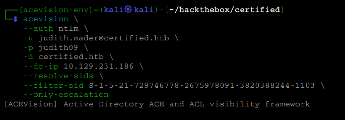
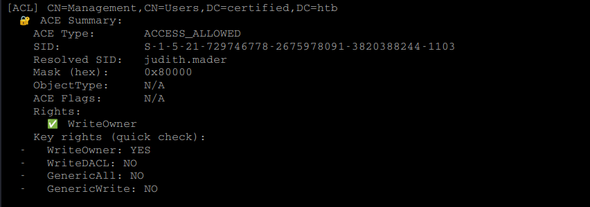
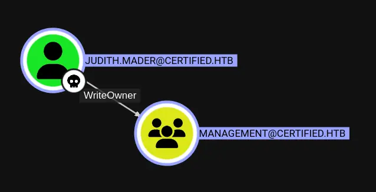

# HTB Certified — ACEVision Case Study

## Overview

This case study demonstrates how ACEVision identifies the exact Active Directory Access Control Entry (ACE) responsible for a BloodHound privilege escalation relationship.

Rather than relying exclusively on graph-based visualization, ACEVision exposes the underlying LDAP security descriptor, trustee SID, and effective permission responsible for object control.

The objective is to validate the relationship between **judith.mader** and the **Management** group and determine exactly why control exists.

---

## Environment

| Item              | Value              |
| ----------------- | ------------------ |
| Machine           | Certified          |
| Domain            | certified.htb      |
| Domain Controller | DC01.certified.htb |
| Initial User      | judith.mader       |
| Authentication    | NTLM               |
| Tool              | ACEVision          |

---

## Objective

Determine why BloodHound reports a WriteOwner relationship between:

```text
judith.mader
        │
        ▼
    Management
```

and identify the exact ACE granting that permission.

---

# Step 1 — Launch ACEVision

The SID associated with the initial user is:

```text
S-1-5-21-729746778-2675978091-3820388244-1103
```

ACEVision was executed using NTLM authentication and filtered to display only escalation-relevant permissions for the target SID.

## Command

```bash
acevision \
    --auth ntlm \
    -u judith.mader@certified.htb \
    -p judith09 \
    -d certified.htb \
    --dc-ip 10.129.231.186 \
    --resolve-sids \
    --filter-sid S-1-5-21-729746778-2675978091-3820388244-1103 \
    --only-escalation
```

## Screenshot



---

# Step 2 — ACEVision Identifies the Responsible ACE

ACEVision identified an ACCESS_ALLOWED ACE granting **WriteOwner** over the Management group.

## Finding

```text
Object:
CN=Management,CN=Users,DC=certified,DC=htb

Trustee:
judith.mader

Permission:
WriteOwner
```

## ACEVision Output

```text
WriteOwner: YES
WriteDACL: NO
GenericAll: NO
GenericWrite: NO
```

## Screenshot



---

# Why This Matters

WriteOwner is frequently underestimated.

Although it does not directly grant GenericAll, ownership allows a principal to take control of an object's security settings.

In practice, an attacker may:

1. Become the owner of the object
2. Modify the DACL
3. Grant additional permissions
4. Escalate to full control

This makes WriteOwner a valuable privilege escalation primitive.

---

# Step 3 — BloodHound Validation

BloodHound independently identifies the same relationship.

## BloodHound Relationship

```text
judith.mader
        │
        ▼
    WriteOwner
        │
        ▼
    Management
```

## Screenshot



---

# Correlation

ACEVision and BloodHound agree on the relationship.

| Tool       | Finding                                |
| ---------- | -------------------------------------- |
| ACEVision  | ACCESS_ALLOWED ACE granting WriteOwner |
| BloodHound | WriteOwner edge                        |
| Result     | Relationship validated                 |

BloodHound visualizes the relationship.

ACEVision explains why the relationship exists.

ACEVision exposes:

* The actual ACE
* The trustee SID
* The resolved identity
* The object being controlled
* The effective permission granting control

This allows operators to validate privilege escalation paths directly from LDAP ACL data.

---

# Lessons Learned

This case study highlights several important Active Directory concepts:

* BloodHound relationships originate from LDAP permissions.
* WriteOwner can be a powerful escalation primitive.
* ACEVision exposes the exact ACE granting control.
* SID-centric analysis explains privilege escalation paths.
* LDAP security descriptors can be used to validate graph relationships.
* Visibility into ACLs helps explain why escalation paths exist.

---

# Conclusion

ACEVision successfully identified the ACCESS_ALLOWED ACE granting WriteOwner over the Management group to **judith.mader**.

By exposing the exact trustee, object, and permission responsible for the relationship, ACEVision transforms abstract graph relationships into concrete, auditable LDAP permissions.

This visibility helps operators, defenders, and students understand not only that a privilege escalation path exists, but why it exists.

