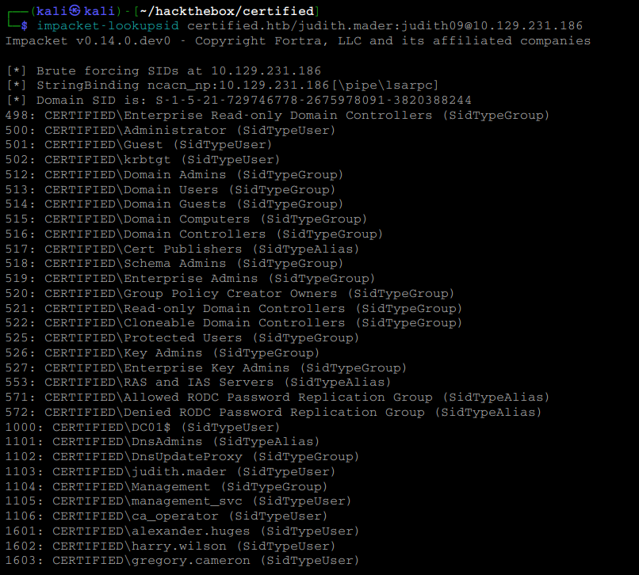

# Finding SIDs

ACEVision works heavily with Security Identifiers (SIDs).

A SID can belong to a user, group, service account, or computer account. Once a SID has been identified, it can be supplied to ACEVision through `--filter-sid` for targeted ACL analysis.

---

# Method 1 — Impacket lookupsid

One of the easiest ways to enumerate domain SIDs is with Impacket.

```bash
impacket-lookupsid domain.htb/user:password@target
```

Example:

```bash
impacket-lookupsid certified.htb/judith.mader:judith09@10.129.231.186
```

## Example Output


The output reveals the domain SID along with the Relative Identifiers (RIDs) assigned to users, groups, service accounts, and computer accounts.

Notable identities discovered in this example include:

* judith.mader (RID 1103)
* Management (RID 1104)
* management_svc (RID 1105)
* ca_operator (RID 1106)

---

# Building a Full SID

A full SID is constructed by combining the Domain SID with the RID.

Example:

```text
Domain SID:
S-1-5-21-729746778-2675978091-3820388244

RID:
1104

Full SID:
S-1-5-21-729746778-2675978091-3820388244-1104
```

The resulting SID can be supplied directly to ACEVision.

---

# Using the SID with ACEVision

After identifying a SID, pass it to ACEVision using `--filter-sid`.

```bash
acevision \
    --auth ntlm \
    -u judith.mader@certified.htb \
    -p judith09 \
    -d certified.htb \
    --dc-ip 10.129.231.186 \
    --resolve-sids \
    --filter-sid S-1-5-21-729746778-2675978091-3820388244-1104 \
    --only-escalation
```

This instructs ACEVision to analyze ACEs associated with the Management group SID.

---

# Why This Matters

ACEVision supports a SID-centric workflow.

Rather than requiring credentials for every account in an escalation path, operators can investigate permissions associated with specific SIDs and follow control relationships throughout Active Directory.

Typical workflow:

```text
Find SID
↓
Run ACEVision with --filter-sid
↓
Review ACEs
↓
Follow the next control relationship
```

---

# Method 2 — BloodHound

BloodHound displays object SIDs in node properties.

Workflow:

```text
Search Object
↓
Open Node Properties
↓
Copy SID
↓
Use with ACEVision
```

---

# Method 3 — LDAP Query

LDAP can also be used to retrieve the `objectSid` attribute directly.

```bash
ldapsearch \
    -x \
    -H ldap://10.10.10.10 \
    -D 'user@domain.htb' \
    -w 'Password123!' \
    -b 'DC=domain,DC=htb' \
    '(sAMAccountName=username)' \
    objectSid
```

Depending on the tooling used, the SID may need to be converted from binary format.

---

# Common SID Targets

Common investigation targets include:

* Current user SID
* Group SID
* Service account SID
* Computer account SID
* BloodHound-discovered objects
* Objects involved in escalation paths

For most ACEVision workflows, `impacket-lookupsid` is the quickest way to begin SID enumeration.

